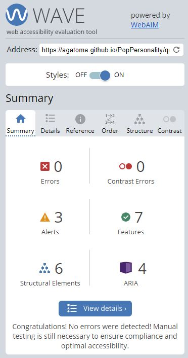
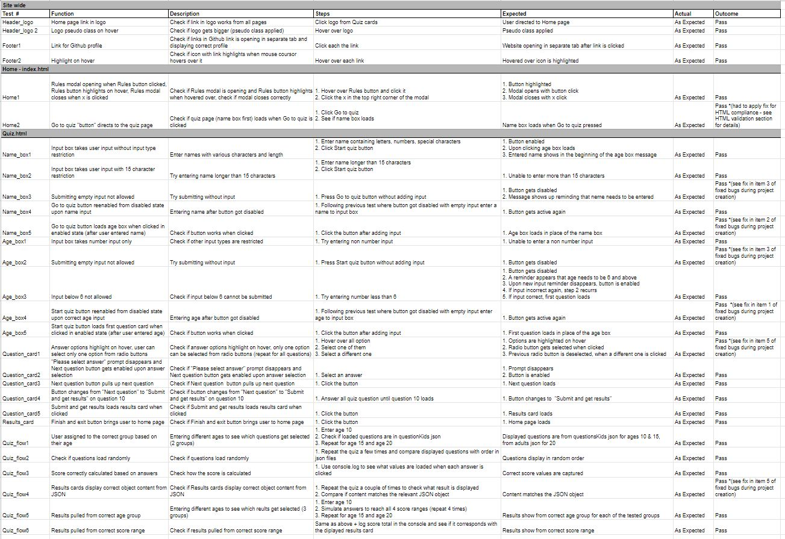

<h1>Overview</h1>
This fun quiz allows users to match with one of the characters from popular movies/series. 
User needs to provide their age to be assigned to one of 3 age groups - kids, teens, adults. After answering a set of 10 random questions user is matched with one of 4 characters based on achieved score total. It was built with HTML, CSS and Javascript only without the use of additional libraries.

[View live website here](https://agatoma.github.io/PopPersonality/)

<h2>User experience & user stories</h2>
<ul>
    <li>Users are matched with characters appropriate for their age group</li>
    <li>Users can find out more about themselves in a fun way</li>
    <li>Users are asked for their name in the beginning to highlight the personal nature of the quiz</li>
    <li>Users can use the quiz on multiple devices thanks to it's responsiveness</li>
    <li>Users can get the results quickly due to only 10 questions each round they take it</li>
    <li>Users can familiarize themselves with the rules easily by accessing the rules modal</li>
</ul>

<h1>Design</h1>
<h2>Sketches</h2>
<h2>Fonts<h2>
<ul>
<li>Josefin Sans 
Used for all content except logo
<ul>
<li>300</li>

<li>400</li>

<li>Bold</li>

</ul>
</li>
<li>Times 
Default browser Times font was kept and used as a base to style the logo (see above)</li>
</ul>

<h2>Colors</h2>
Background photo of a person partly covered with colourful powder/mist on a black background was used as an inspiration for the color palette
To ensure proper contrast text boxes were also given dark background with a level of opacity applied
For correct contrast, content font is white with the exception of styled logo, which is pink.
The chosen color palette is to combine pop gaudiness of pink accents (site logo, Github logo) and a mix of yellow, shades of pink and blue with a psychological mystery of dark backgrounds (main and card/text boxes). Mix of colors also indicates a mix of personalities.
<h2>Quiz flow</h2>
<ul>
<li>Greeting screen with invitation to quiz</li>
<li>User can read rules by pressing and popping out Rules modal</li>
<li>User presses Go to quiz to start - User asked for name - name input with empty validation - User addressed by name and asked for age - age input with empty/number validation 
<li>On start quiz user assigned to relevant age group for question selection</li>
<li>10 Questions are selected randomly for user out of 20 available (kids & teens same sets of questions)</li>
<li>User answers question - selects yes, no, sometimes on radio buttons - set score for each selection is captured</li>
<li>User completes all 10 questions - after 10th question submission score is calculated (total of captured individual values)</li>
<li>Based on score results card is displayed (4 characters for each of 3 groups, each characted has a score value range)</li>
</ul>
<h1>Features</h1>
<h2>Site wide<h2>
<h3>Favicon<h3>
Butterly favicon will help the user identify the website quickly, when having multiple tabs open in the browser.

<h3>Logo<h3>

Logo made of pink Times font letters with a whitish hue is present on all pages/cards displayed. It also serves as a link directing the user to the Home page. The logo is placed inside a header.

<h3>Footer<h3>

Footer includes a short description of the site's purpose and a link to the author's Github profile. 

<h3>404 page<h3>

This page will appear when user navigates to a broken link. It will allow user to go back to the home page by clicking the displayed logo, which is more user friendly than trying the browser back arrow.

<h2>Home page (intro)</h2>
<h3>Description</h3>

This section has a short introduction to the quiz, explaining what it is and directing user to Rules modal for further details. 

<h3>Rules modal</h3>

User can access the Rules modal by clicking Rules button under description. 

The modal format to contain rules details was used to save space on the home page and to provide a user controlled experience. User can close the modal by clicking "x" in the top right corner of the modal.

<h3>Go to quiz</h3>

To proceed to the quiz page, user clicks the Go to quiz button. 

<h2>Quiz page</h2>
<h3>Name box</h3>

Name box appears before user can access quiz questions. User needs to enter their name. Blank submission is not possible - the submit button is disabled upon blank submission attempt and reenabled when user fills out the input box. The name is captured to personalize the next step and also for adding future features, when user information would be stored in a database. 

<h3>Age box</h3>

Next user needs to fill out their age to be assigned to the correct set of questions (Set 1: Kids/teens, Set 2: Adults). A placeholder is added to let user know the correct format. The input box itself is requiring a number format and blank or non number submission is not allowed with the validation method as name box (logic changed to check for specific age box requirements).

<h3>Question cards</h3>

After age is correctly filled out, user is given 10 questions, which are randomly selected from the set user was assigned to based on their entered age. Counter on top lets the user know which question out of how many they are currently answering. In order to proceed to the next question, user needs to make a selection out of 3 possible answers. Until they make the first selection, they see a prompt to select an asnwer right above the disabled next button. Upon first selection, the button is enabled/becomes active. User can change their mind and choose a different answer before submitting the final selection and proceeding to next question via the Next question button. 

<h3>Results card</h3>

After user answers all 10 questions, the score is calculated as a total of each individual selection score. Based on the score user is matched with one of the four characters from one of the three age groups that user was assigned to based on their entered age. The groups are kids (8 - 12), teens (13 - 17) & adults (from 18). Results card displays a thank you message, matched character name, image and short caption/description. 

<h2>Future</h2>
<ul>Features to be added in potential future deployments
<li>Results storage for individual users (database)</li>
<li>Results summary with most and least frequent occurences (database)</li>
<li>Emailing results to users - user controlled</li>
<li>Using a questions API (if available) to increase the amount of questions</li>
<li>Adding more options for results, matching score with results based on actual psychological research/resources</li>
<li>Adding a user led role play game with set of questions, where outcome depends on selected answers with story related to the matched character</li>
</ul>

<h1>Technologies</h1>
<ul>
<li>HTML</li>
The structure of the website was developed using HTML as the main language.
<li>CSS</li>
The website was styled using custom CSS in an external file.
<li>Javascript</li>
The logic was built with plain Javascript stored in external files.
<li>JSON and Fetch API</li>
Questions and results are stored in object arrays in external JSON files with Fetch used to link and transfer with JS file. 
<li>favicon.io</li>
Favicon was selected from https://favicon.io/. 
<li>Google fonts</li>
Josefin Sans font was taken from https://fonts.google.com/
<li>Chrome Dev Tools</li>
Elements tool was used for styling testing and Console for Javascript testing/validation/troubleshooting.
<li>JSHint</li>
Used to test the Javascript code throughout the creation of the project.
<li>Gitpod</li>
The website was developed using Gitpod in Chrome
<li>GitHub</li>
Source code is hosted on GitHub and deployed using Git Pages.
<li>Git</li>
Used to commit and push code during the development of the Website
<li>Tinyjpg</li>
https://tinyjpg.com/ was used to reduce the size of the images 
<li>Convertio</li>
JPG format gallery photos were converted to webp using https://convertio.co/jpg-webp/ 
</ul>
<h1>Testing<h1>
<h2>Accessibility</h2>
Care was taken to ensure sufficient level of accessibility and user friendliness by using semantic HTML elements, aria-labels, appropriate color contrast, different hover and active states, sans serif font. Accessibility was tested during the project creating as well as upon completion with [Wave](https://wave.webaim.org/) - Web Accessibility Evaluation Tool. No errors were detected.

<h2>Lighthouse</h2>

<h2>Validator testing</h2>

<h3>HTML</h3>

Website was tested with [W3C validator](https://validator.w3.org/). 

<h4>Error and fix</h4>
While still during creation an error was returned for one of the elements (Go to quiz button on index.html) highlighting that anchor tag cannot be wrapped in a button. In order to comply with HTML best practice button tags were removed and anchor element was styled instead with CSS to achieve desired button appearance. Validation of the completed project returned no errors.

<h4>Final results</h4>

<h3>CSS</h3>

Website was tested with [W3C jigsaw validator](https://jigsaw.w3.org/css-validator/). No errors were returned.

<h3>JavaScript</h3>

Website was tested with [JS Hint](https://jshint.com/) during creation and also after completion. No errors were returned, however during creation the hints proved useful to solve minor logic inaccuracies (variable scope) and semicolons being present in the right places.

<h2>Functional testing</h2>
<h3>Testing of completed project</h3>

[Document can be viewed here](https://docs.google.com/spreadsheets/d/1OmoTnrLqkl4eOBPQx-ZzcdWkGLoL6733fwl_z3dp3n0/edit?usp=sharing)

<h3>Functional testing during project creation - main bugs and fix summary</h3>
<ol>
<li>Problem: startQuizButton only working when agebox is empty first, button disabled, box filled out, button enabled, working then
<ul>
<li>Fix a: added else statement with event listener on startQuizButton, but in this scenarion button had to be clicked twice to load quiz </li>
<li>Fix b: Removed event listener in the else statement and left startQuiz function only</li>
</ul>
</li>
<li>Problem: nameBox loads twice every now and again (each 4 - 6 submissions)
<ul>
<li>Fix: Removed form tags that were wrapped around nameBox and ageBox content</li>
</ul>
</li>
<li>Problem: HTML form contol (required attribute) would not work on hidden elements
<ul>
<li>Fix: Introduced input validation via JS instead</li>
</ul>
</li>
<li>Problem: Console showing warning failed to load source map
<ul>
<li>Fix: in Settings unticked "Enable JavaScript source maps"</li>
</ul>
</li>
<li>Problem: Images not showing after deployment
<ul>
<li>Fix: Removed "assets" from path - still not working with "../images/title, changed to one dot path based on the advice here
https://github.com/orgs/community/discussions/23086</li>
</ul>
</li>
<li>Problem: target area allowing to make selection on the answer was limited to the actual radio and label text displayed, test users reported this as too much of an inconvenience
<ul>
<li>Fix: changed label and input tags order based on the advice here https://stackoverflow.com/questions/7727255/how-can-i-make-an-html-radiobutton-with-a-big-target-area</li>
</ul>
</li>
</ol>

<h2>Responsiveness</h2>

Responsive fixes for mobiles (Filip) and laptops - Results card
Fix: add wrap feature for description text on results card
Finish button pushed too high on the results card content (small screens) - adjusted height to fix
<h1>Deployment</h1>
<h2>Version Control</h2>
Site was created and developed with GitHub using Gitpod in Chrome. The following commands were used for version control.
<ul>
    <li>git add . - add changes to staging area before committing</li> 
    <li>git commit -m "commit message" - committing staged changes to the local repository</li>
    <li>git push - pushing commited changes to the GitHub remote repository</li>
</ul>

<h2>Deployment with GitHub Pages</h2>

Site was deployed using GitHub Pages by following Settings -> Pages -> Deploy from a branch - choose main - click Save. 

Live website can be found [here](https://agatoma.github.io/PopPersonality) 
GitHub repository can be found [here](https://github.com/AgaToma/PopPersonality)

<h2>Forking & Cloning</h2>
<h1>Credits</h1>
<h2>References</h2>
Used the below resources for reference and help.

[Build a quiz app with Javascript by WebDev Simplified](https://www.youtube.com/watch?v=riDzcEQbX6k) 
[Build a quiz app by James Q Quick - Fetch API to Load Local Questions](https://www.youtube.com/watch?v=jK5zzSA2JHI&list=PLDlWc9AfQBfZIkdVaOQXi1tizJeNJipEx&index=12) 
[Build a quiz app by James Q Quick - Display Hard Coded Question](https://www.youtube.com/watch?v=zZdQGs62cR8&list=PLDlWc9AfQBfZIkdVaOQXi1tizJeNJipEx&index=4) 

https://github.com/kera-cudmore/TheQuizArms  
https://github.com/MattBCoding/ufoduel  
https://github.com/suzybee1987/milestone-2  

https://www.w3schools.com/jsref/prop_select_disabled.asp  
https://www.w3schools.com/howto/howto_css_modals.asp  
https://developer.mozilla.org/en-US/docs/Learn/JavaScript/Objects/JSON  
https://developer.mozilla.org/en-US/docs/Web/API/Fetch_API/Using_Fetch  
https://developer.mozilla.org/en-US/docs/Web/JavaScript/Reference/Global_Objects/Array/reduce  
https://www.geeksforgeeks.org/how-to-get-value-of-selected-radio-button-using-javascript/?ref=rp  
https://www.freecodecamp.org/news/html-button-link-code-examples-how-to-make-html-hyperlinks-using-the-href-attribute-on-tags/  
https://stackoverflow.com/questions/7727255/how-can-i-make-an-html-radiobutton-with-a-big-target-area  
https://github.com/orgs/community/discussions/23086 

<h2>Acknowledgements</h2>
<h2>Images</h2>

Character images were taken from fandom wikis. Background image is a free to use photo from Unsplash.

[Elsa](https://wallpapers.com/images/high/elsa-walking-frozen-2-kkkamcsuf192gqow.webp) 
[Chaorion](https://ghostforce.fandom.com/wiki/Chaorion?file=Chaorion+basic+form.png) 
[Kion](https://disney.fandom.com/wiki/Kion?file=Profile_-_Kion_S3.png) 
[Kevin](https://despicableme.fandom.com/wiki/Kevin_(Despicable_Me_2)?file=Tall.jpg) 
[Eleven](https://strangerthings.fandom.com/wiki/Eleven?file=Eleven+-+The+Piggyback.png) 
[Enid](https://addamsfamily.fandom.com/wiki/Enid_Sinclair?file=EnidSinclairN.webp) 
[Jack](https://great-characters.fandom.com/wiki/Captain_Jack_Sparrow?file=Jacksparrow.jpeg) 
[Luke](https://headhuntersholosuite.fandom.com/wiki/Luke_Skywalker?file=Luke_Skywalker_001.jpg) 
[Jon](https://ultimatepopculture.fandom.com/wiki/Jon_Snow?file=Jon_Snow-Kit_Harington.jpg) 
[Geralt](https://witcher.fandom.com/wiki/Geralt_of_Rivia?file=Netflix+geralt+shirt.jpg) 
[Lag](https://vikings.fandom.com/de/wiki/Lagertha) 
[Jyn](https://rogue-one.fandom.com/wiki/Jyn_Erso?file=JynErsoScarif.jpg) 
[Background](https://unsplash.com/photos/YCF34YywBrs?utm_source=unsplash&utm_medium=referral&utm_content=creditShareLink) - author - David Becker (Unsplash)

<h2>Content</h2>
Content of the website is fictional and was created for educational purposes of building the website by it's author (Aga Tomaszewska). It is not based on any psychological or personality research, results are generated mathematically based on random score question.

<h2>Copyright disclaimer?</h2>