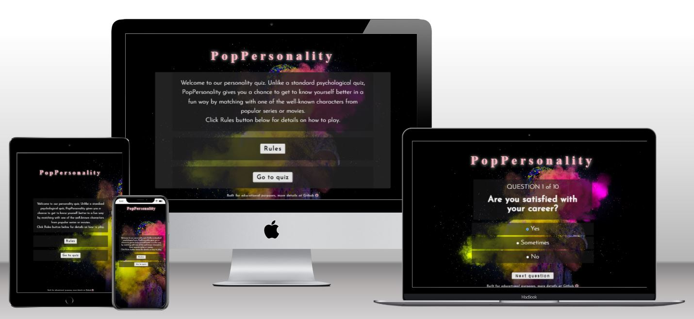

<h1>Overview</h1>
This fun quiz allows users to match with one of the characters from popular movies/series. 
User needs to provide their age to be assigned to one of 3 age groups - kids, teens, adults. After answering a set of 10 random questions user is matched with one of 4 characters based on achieved score total. It was built with HTML, CSS and Javascript only without the use of additional libraries.

[View live website here](https://agatoma.github.io/PopPersonality/)

<h2>User experience & user stories</h2>
<ul>
    <li>Users are matched with characters appropriate for their age group</li>
    <li>Users can find out more about themselves in a fun way</li>
    <li>Users are asked for their name in the beginning to highlight the personal nature of the quiz</li>
    <li>Users can use the quiz on multiple devices thanks to it's responsiveness</li>
    <li>Users can get the results quickly due to only 10 questions each round they take it</li>
    <li>Users can familiarize themselves with the rules easily by accessing the rules modal</li>
</ul>

<h1>Design</h1>
<h2>Sketches</h2>
<h2>Fonts<h2>
<ul>
<li>Josefin Sans

Used for all content except logo 

<ul>
<li>300</li>

<li>400</li>

<li>Bold</li>

</ul>
</li>
<li>Times</li>
Default browser Times font was kept and used as a base to style the logo (see above)
</ul>
<h2>Colors<h2>
Background photo of a person partly covered with colourful powder/mist on a black background was used as an inspiration for the color palette
To ensure proper contrast text boxes were also given dark background with a level of opacity applied
For correct contrast, content font is white with the exception of styled logo, which is pink
<h2>Quiz flow</h2>
<ul>
<li>Greeting screen with invitation to quiz</li>
<li>User can read rules by pressing and popping out Rules modal</li>
<li>User presses Go to quiz to start - User asked for name - name input with empty validation - User addressed by name and asked for age - age input with empty/number validation 
<li>On start quiz user assigned to relevant age group for question selection</li>
<li>10 Questions are selected randomly for user out of 20 available (kids & teens same sets of questions)</li>
<li>User answers question - selects yes, no, sometimes on radio buttons - set score for each selection is captured</li>
<li>User completes all 10 questions - after 10th question submission score is calculated (total of captured individual values)</li>
<li>Based on score results card is displayed (4 characters for each of 3 groups, each characted has a score value range)</li>
</ul>
<h1>Features</h1>
<h2>Site wide<h2>
<h3>Favicon<h3>
<h3>Logo<h3>
<h2>Home page (intro)</h2>
<h3>Description</h3>
<h3>Rules modal</h3>
<h3>Go to quiz</h3>
<h2>Quiz page</h2>
<h3>Name box</h3>
<h3>Age box</h3>
<h3>Question cards</h3>
<h3>Results card</h3>
<h2>Future</h2>
<h1>Technologies</h1>
<ul>
<li>HTML</li>
<li>CSS</li>
<li>Javascript</li>
<li>favicon.io</li>
<li>Google fonts</li>
<li>Chrome Dev Tools</li>
<li>JSHint</li>
<li>Gitpod</li>
    The website was developed using Gitpod in Chrome
    <li>GitHub</li>
    Source code is hosted on GitHub and deployed using Git Pages.
    <li>Git</li>
    Used to commit and push code during the development of the Website
    <li>Tinyjpg</li>
    https://tinyjpg.com/ was used to reduce the size of the images 
    <li>Convertio</li>
    JPG format gallery photos were converted to webp using https://convertio.co/jpg-webp/ 
<li></li>
</ul>
<h1>Testing<h1>
<h2>Accessibility</h2>
<h2>Validator testing</h2>
<h2>Functional testing</h2>
Add Google sheet
<h2>Responsiveness</h2>
<h2>Bugs & fix summary?</h2>
<h1>Deployment</h1>
<h2>Version Control</h2>
Site was created and developed with GitHub using Gitpod in Chrome. The following commands were used for version control.
<ul>
    <li>git add . - add changes to staging area before committing</li> 
    <li>git commit -m "commit message" - committing staged changes to the local repository</li>
    <li>git push - pushing commited changes to the GitHub remote repository</li>
</ul>

<h2>Deployment with GitHub Pages</h2>

Site was deployed using GitHub Pages by following Settings -> Pages -> Deploy from a branch - choose main - click Save. 

Live website can be found [here](https://agatoma.github.io/PopPersonality) 
GitHub repository can be found [here](https://github.com/AgaToma/PopPersonality)

<h2>Forking & Cloning</h2>
<h1>Credits</h1>
<h2>References</h2>
<h2>Acknowledgements</h2>
<h2>Images</h2>
<h2>Content</h2>
<h2>Copyright disclaimer?</h2>